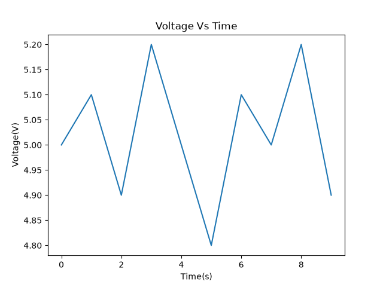
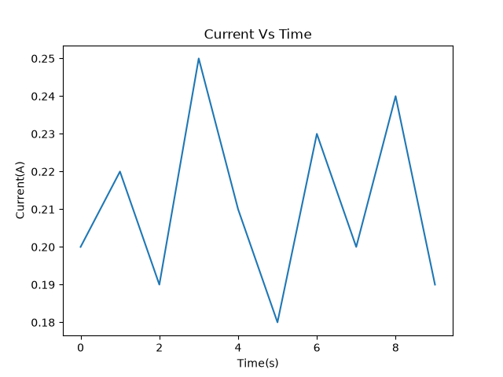
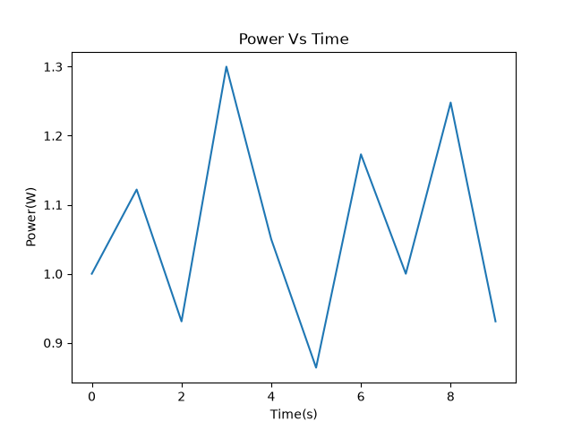

# EE Power Analyzer

## Description:
This Python Project reads electrical measurements data from a CSV file, the code calculates and analyzes voltage, current, power, and resistance.

## Features:
- Reads CSV data with pandas
- Calculate power using the formula P = VI
- Calculates resistance using the formula R = V/I
- Finds average, minimum, and maximum values
- Creates voltage, current, and power Vs time graphs
- Detect zero-current values marking it as "Undefined"
- Exported an analyzed data to a new CSV file

## Technologies Used:
- Python
- pandas
- matplotlib

## Input Data:
The input CSV file contains:
- Time
- Current
- Voltage

## Formulas:
- P = VI
- R = V/I

## Output:
The code creates:
- Electrical statistics in the terminal
- Three graphs
- an analyzed_data.csv file

## What i learned:
- Reading CSV files with pandas
- Working with DataFrame
- Using functions
- Creating graphs
- Applying electrical engineering formulas and ideas with Python
- Error checking

## Results
### Voltage vs Time

### Current vs Time

### Power vs Time

## How to Run
1. Clone this respository
1. Make sure Python is installed
1. Install the required libraries:
'''bash
pip install pandas matplotlib
1. Make sure the CVS file is in the same folder as Power_Analyzer.py
1. The program will:
print the statistics in the terminal
gnerate voltage, current, and power graphs
create a CVS file with the analyzed data